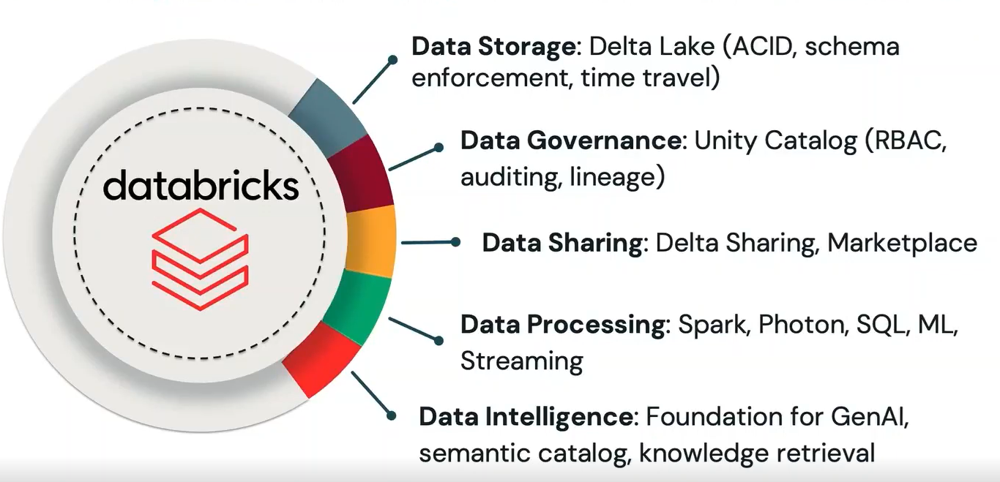

# Lakehouse components
이번에는 Lakehouse가 무엇으로 구성되어 있는지 살펴보도록 하겠습니다. 

Lakehouse는 겉보기엔 하나의 플랫폼처럼 보이지만, 사실은 몇 개의 핵심 레이어가 딱 맞물려 돌아가면서 저장부터 분석, 거버넌스, 그리고 AI까지 한 번에 가능하게 만들어줍니다.

## 데이터 스토리지: Delta Lake
Lakehouse의 첫 번째 레이어는 데이터를 저장하는 스토리지 레이어입니다. 여기서 중심 역할을 하는 게 Delta Lake입니다.

Delta Lake는 단순히 "클라우드 오브젝트 스토리지에 데이터를 저장하는 포맷"이 아니라, 그 위에서 **ACID 트랜잭션** 을 제공합니다. 즉, 데이터가 들어오고 업데이트되는 과정에서 일관성과 안정성을 확보할 수 있다는 뜻입니다.

Delta Lake의 대표적인 특징은 다음과 같습니다.

✅ 스키마 강제

    Delta Lake는 스키마가 맞지 않으면 아예 쓰기를 막는 기능도 제공합니다.
    예를 들어, 원래 고객ID가 숫자여야 하는데 갑자기 문자열이 들어오면?
    그냥 "일단 저장"이 아니라, 스키마 불일치로 저장 자체가 실패하게 만들 수 있습니다. 데이터 품질 관리가 훨씬 쉬워지게 됩니다.

✅ 스키마 진화

    반대로 자동으로 스키마를 조정하는 기능도 제공합니다. 
    예를 들어 매일 밤 데이터를 업로드하는 시스템에서,데이터 엔지니어가 "필요한 컬럼은 이 정도겠지" 하고 스키마를 정의해 두었는데, 그런데 ETL 파이프라인을 통해 데이터가 들어오는 중에 **새 속성(컬럼)**이 하나 추가되는 경우, 이때 스키마 진화가 켜져 있다면, Delta Lake가 자동으로 스키마를 업데이트하고 새 컬럼까지 포함해서 데이터를 반영합니다.
    즉, 사람이 매번 스키마를 수정하러 뛰어들지 않아도, 자동으로 따라가게 만들 수 있습니다.

✅ 성능

    Delta Lake는 안정성만 주는 게 아니라 성능 최적화도 제공합니다.

    - Liquid Clustering
    - Z-Order 인덱싱
    - 디스크 캐싱

    이런 기술들을 통해 쿼리 성능을 끌어올릴 수 있습니다. 
    
정리하면, Delta Lake는 **저장 + 품질 + 성능** 을 동시에 잡는 계층이라고 할 수 있습니다.

## 데이터 거버넌스: Unity Catalog
두 번째는 데이터 거버넌스입니다. 이 역할은 Unity Catalog가 담당합니다.
Unity Catalog는 한마디로 말하면, **조직 전체 데이터에 대한 질서와 통제**를 만드는 계층입니다.

- 역할 기반 접근 제어(RBAC): 누가 어떤 데이터에 접근할 수 있는지 역할로 관리
- 중앙 집중식 감사: 누가 언제 무엇을 했는지 추적
- 전체 데이터 계보(Data Lineage): 데이터가 어디서 와서 어디로 흘러갔는지 전체 흐름을 확인

그리고 중요한 포인트는, 이게 단일 워크스페이스만이 아니라 조직 내 모든 워크스페이스를 가로질러 적용된다는 점입니다.
즉, 거버넌스가 "부분적"으로 적용되는 것이 아니라 "전체적으로" 확장됩니다.

## 데이터 공유: Delta Sharing
세 번째는 **데이터 공유(Data Sharing)** 입니다.
이 기능은 **Delta(또는 Delta Sharing)** 을 통해 제공됩니다.

핵심은:

- 데이터를 복사해서 전달하지 않고도,
- 내부 팀이나 외부 파트너와 안전하게 데이터 교환이 가능하다.

복사본이 여기저기 생기면 보안도 복잡해지고, 데이터가 최신인지도 알 수 없습니다.

Delta Sharing 방식은 그런 문제를 줄여주고, 무엇보다 이 공유 과정도 Unity Catalog의 관리 하에서 이뤄집니다.
즉, 공유가 "편리하기만 한 기능"이 아니라, 거버넌스에 의해서 관리되는 공유라는 점이 강점입니다.

## 데이터 처리: 엔진 == Spark, 가속 == Photon
이제 데이터 처리 레이어를 살펴보겠습니다.

Databricks를 만든 창립자들은 2009~2010년에 Spark를 만들고 Apache 재단에 기부했습니다. 그리고 그 위에 Databricks를 설립했습니다.

그래서 자연스럽게 Databricks에서 Spark는 모든 워크로드의 핵심 엔진이 되었습니다.

- BI
- 머신러닝
- 데이터 엔지니어링

뭐를 하든 기본적으로 데이터는 Spark 기반으로 처리됩니다.

✅ Photon: BI/리포팅에 최적화된 실행 프레임워크

    여기서 등장하는 게 Photon입니다.
    Photon은 Spark와 함께 동작하면서, 특히 BI 워크로드와 리포트 작성에 최적화되어 있습니다.
    BI 환경에서 중요한 건 뭘까요?
    바로 쿼리 응답 속도입니다. Photon은 이런 성능 기대치를 만족시키는 데 초점을 두고 있습니다.

✅ 언어는 마음대로 고르면 됩니다.
    
    Spark API와 상호작용하기 위한 언어도 다양하게 지원합니다.

    - SQL
    - Python
    - R
    - Scala

    즉, 팀이 어떤 언어에 익숙하든 그걸로 바로 시작할 수 있습니다.

✅ 스트리밍 기능도 강력합니다.

    데이터 처리에 있어서 또 하나 중요한 점은 스트리밍 처리입니다.
    실시간 데이터 수집과 처리를 지원하고, 이건 단순 스트리밍만이 아니라 모든 워크로드에서 활용 가능합니다.

    예를 들어 머신러닝에서도:

    - 실시간/준실시간 모델 예측
    - 모델 스코어링

    같은 작업들을 자연스럽게 가능하게 됩니다.

## 데이터 인텔리전스 계층: AI

마지막 레이어는 가장 최신 흐름인, 데이터 인텔리전스 계층입니다.

Lakehouse에 AI 계층이 추가된 형태가 데이터 인텔리전스 플랫폼이라고 할 수 있습니다.

이 계층이 하는 일은 다음과 같습니다:

- 생성형 AI(GenAI) 워크로드 지원
- 데이터에 대한 시맨틱 이해(의미 이해)
- 코딩 어시스턴트 기능
- 자연어로 데이터와 상호작용

여기서 중요한 포인트는 "누가 쓰느냐" 입니다.
조직의 리더십, 즉 코딩을 모르고, 배우고 싶어 하지도 않는 사람들도 많죠.

이 플랫폼은 그런 사람들도 영어든, 한국어든, 어떤 언어든 자연어로 질문해서 데이터를 기반으로 인사이트를 얻을 수 있게 해줍니다.

## 완전한 통합
정리하면 Lakehouse는 단순히 저장소가 아니고, 플랫폼 전체가 맞물려서 동작합니다.

- 저장(Delta Lake)
- 거버넌스(Unity Catalog)
- 공유(Delta/Delta Sharing)
- 처리(Spark + Photon)
- AI(데이터 인텔리전스 계층)

이 모든 구성 요소가 함께 모여 완전한 통합 플랫폼을 형성하고,
여기에 AI가 더해지면서 훨씬 더 흥미로운 방향으로 확장되고 있습니다.

Lakehouse가 혁신적인 이유는 "구성이 많아서"가 아니라,
각 레이어가 따로 노는 게 아니라 하나로 묶여서 동작한다는 점입니다.

✍️ 2026년 2월 3일 씀.