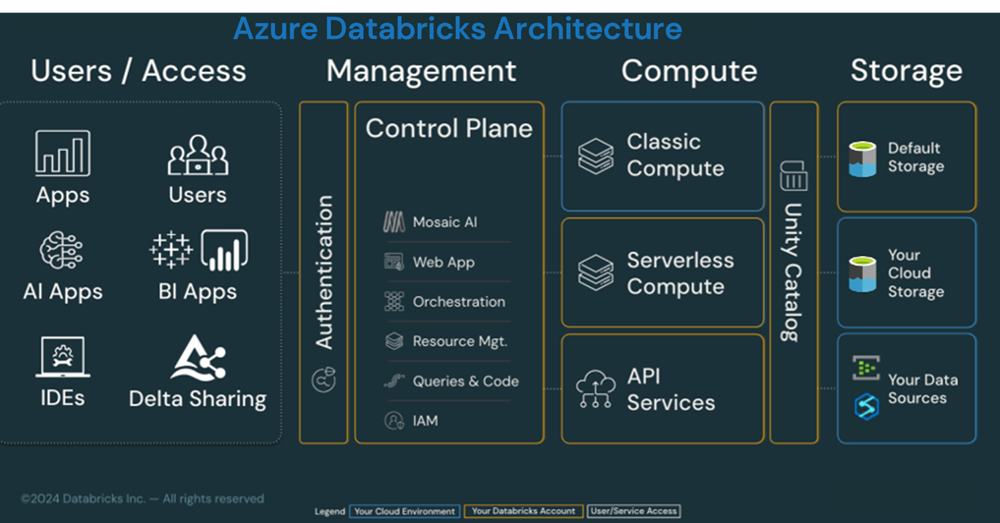

# Azure Databricks Data Intelligence Platform이란?

데이터 분석과 AI 기술이 기업 경쟁력의 핵심이 된 지금, 많은 조직이 이런 질문을 던집니다.

> "데이터를 저장하는 것만으로는 부족한데,
> 분석, 거버넌스, AI까지 하나의 플랫폼에서 처리할 수는 없을까?"

이 질문에 대한 Databricks의 답이 바로
**Azure Databricks Data Intelligence Platform** 입니다.

이 글에서는 **Azure Databricks Data Intelligence Platform이 무엇인지**,
**왜 기존 Lakehouse 개념을 넘어 'Data Intelligence'라는 이름을 사용하게 되었는지**를 초보자 관점에서 어떻게 이해하면 되는지를 살펴봅니다.

> 📣 이번 글에서는 아키텍처의 구성 요소들에 대한 개요만을 설명합니다. 각 구성 요소별로 자세한 내용은 별도의 강좌로 작성하여 설명할 예정입니다.

## 1. Azure Databricks, 짚고 가기
Azure Databricks는 Microsoft Azure에서 제공하는
**Apache Spark 기반의 완전 관리형 분석 플랫폼**입니다.

기존에 Databricks를 다음과 같이 이해하셨다면 반은 맞고, 반은 부족합니다.

* ❌ "대규모 데이터를 처리하는 Spark 플랫폼"
* ❌ "데이터 엔지니어를 위한 분석 도구"

이제 Databricks는 다음과 같이 정의할 수 있습니다.

> 📎 **데이터 엔지니어링, 데이터 분석, 머신러닝, AI, 거버넌스까지**
>
> **하나로 통합된 Data Intelligence Platform**

## 2. 왜 'Data Intelligence Platform'인가?

예전에는 Databricks를 **"Lakehouse 플랫폼"** 으로 설명했습니다. Lakehouse는 **Data Lake의 유연성과 저비용 + Data Warehouse의 성능과 관리성**을 함께 가져가자는 철학이었십니다. 하지만 최근 기업이 데이터 플랫폼에 기대하는 역할은 더 커졌습니다.

* 🛑 데이터를 저장/처리하는 것만으로는 부족.
* 🛑 데이터는 결국 "의사결정"과 "업무 자동화", "AI 활용"으로 이어져야 함.
* 🛑 그리고 그 과정에서 가장 큰 장애물은 통상은 기술이 아니라 거버넌스, 보안, 운영 복잡도.

Databricks가 "Data Intelligence Platform"이라고 부르는 이유는, 데이터가 단지 쌓이는 저장소가 아니라 조직의 데이터가 '이해되고(meaning)', '사용되고(utilized)', '자동화로 연결(agents/apps)'되는 플랫폼을 지향하기 때문입니다. Databricks 역시 2025 Data+AI Summit에서 "data intelligence"를 핵심 키워드로 강조하며, 플랫폼이 AI 시대의 의사결정 기반이 되어야 한다는 비전을 반복해서 언급합니다. 

Microsoft도 Azure Databricks를 "Data Intelligence Platform" 관점으로 보고 있으며, Lakehouse 기반 위에 데이터/분석/AI를 통합하고 인프라 부담을 줄이는 방향을 강조합니다.

## 3. Azure Databricks Data Intelligence Platform 개요
Azure Databricks Data Intelligence Platform은 다음을 목표로 합니다.

* ✅ 데이터 수집부터 분석, AI 활용까지 하나의 플랫폼에서 제공
* ✅ 거버넌스와 보안을 데이터 중심으로 일원화
* ✅ 사용자와 워크로드에 따라 유연한 컴퓨트 운영
* ✅ 클라우드 네이티브 + 서버리스 지향

## 4. 아키텍처

위 그림은 Data Intelligence Platform을 이해하는 데 가장 중요한 그림입니다.

Azure Databricks 아키텍처는 크게 네 가지 영역으로 나뉩니다. 

먼저, Control plane(위의 그림에서 Management에 해당)과 Compute plane에 대해서 살펴보도록 하겠습니다. 

### 4.1 Control Plane와 Compute Plane의 분리

#### 4.1.1 Control Plane (관리 영역)
Control Plane은 플랫폼의 두뇌라고 할 수 있습니다. 간단하게 정리하면,  **Databricks가 관리해주는 '서비스 영역'** 입니다.

Control Plane에는 다음과 같은 기능들이 포함됩니다.

* ✅ Workspace/Notebook/Job 관리
* ✅ 클러스터/SQL Warehouse 설정 및 정책
* ✅ 사용자/그룹/프로비저닝 같은 IAM
* ✅ Unity Catalog 메타스토어 연결 및 관리
* ✅ 다양한 서비스 설정(시스템 구성)

> 📣 사용자는 직접 느끼지 못하지만, Databricks가 "관리형 서비스"인 이유가 바로 control plane에서 기인합니다.

#### 4.1.2 Compute Plane (연산 영역)
Compute Plane은 실제로 **데이터를 처리하는 공간**입니다. Azure Databricks에서는 두 가지 방식으로 연산을 처리할 수 있습니다.

✅ Classic Compute
* 사용자의 Azure 구독 내 VM 사용
* 노드 타입, 크기, 개수 직접 관리
* 비교적 PaaS 형식

상기의 아키텍처에서 Classic Compute가 푸른색 상자로 표현이 되고 있으며, 이는 사용자의 Azure 구독에 VM 리소스가 생성됨을 의미합니다.

참고 : [https://learn.microsoft.com/en-us/azure/databricks/getting-started/high-level-architecture](https://learn.microsoft.com/en-us/azure/databricks/getting-started/high-level-architecture)

✅ Serverless Compute
* 완전히 Databricks가 관리
* 사용자는 "서버리스" 옵션만 선택하면 됨
* 내부적으로 AI 기반 자동 최적화
* 현재 Databricks가 지향하는 방향

상기의 아키텍처에서 Classic Compute와는 다른 색의 상자로 표현이 되고 있으며, 이는 Databricks의 계정에 연산 리소스들이 생성됨을 의미합니다.

참고 : [https://learn.microsoft.com/en-us/azure/databricks/getting-started/high-level-architecture](https://learn.microsoft.com/en-us/azure/databricks/getting-started/high-level-architecture)

> 📣 최근 Databricks는 **모든 주요 워크로드에 Serverless를 확장**하고 있습니다.
> Servirless를 사용하게 되면 다음과 같은 장점을 얻을 수있습니다.
> * 빠른 시작/확장: 필요한 컴퓨트를 자동 할당 → 시작/스케일링 시간 단축
> * 운영 부담 감소: 패치/업그레이드/용량관리 등의 부담을 줄임(특히 SQL Warehouse에서 강점)
> * Unity Catalog 전제: serverless는 UC 기반 거버넌스 모델 위에서 더 일관된 보안/접근 모델을 제공
> 다만, serverless에는 제한 사항이 존재하며(예: 특정 언어/기능 제약 등), 워크로드 특성에 따라 classic이 필요한 경우도 있습니다. 

요약하면, Control Plane와 Compute Plane의 분리를 통해서, 관리(Management)와 실행(Execution)이 분리될 수 있으며, 해당 구조가 Databricks 가치의 출발점이라고 할 수 있습니다. 즉, Databricks를 "단순히 Spark 클러스터"로 이해하면 핵심을 놓치게 됩니다.

### 4.2 Unity Catalog – Data Intelligence의 핵심
다음은 Unity Catalog입니다.

아키텍처 다이어그램에서 Compute ↔ Storage 사이에 위치하고 있습니다. Unity Catalog는 단순한 메타스토어가 아니라, **컴퓨트와 스토리지 경계에서 모든 자산을 '거버닝'하는 핵심**입니다.

Unity Catalog는 다음과 같은 역할을 담당합니다.

* 데이터, 테이블, 뷰, 파일에 대한 중앙 거버넌스
* 사용자 · 그룹 · 워크로드 단위 접근 제어
* 데이터 계보(Lineage) 추적
* 외부 데이터 소스 통합 관리

> 📣 한마디로,
> **"Databricks 플랫폼 전체의 보안과 신뢰를 책임지는 중추"** 라고 할 수 있습니다.

### 4.3 Storage 계층과 데이터 관리
아키텍처의 가장 우측에 위치하고 있는 storage 계층은 말 그대로 Databricks에서 데이터를 저장하는 공간입니다.

Azure Databricks의 기본 스토리지는 Azure Data Lake Storage Gen2(ADLS Gen2) 입니다.
Unity Catalog와 함께 사용할 경우, ADLS Gen2는 Managed Storage 또는 External Location 형태로 운영됩니다.

Azure Databricks에서 사용할 수 있는 기본 저장소는 다음과 같습니다.

* Azure Data Lake Storage Gen2 (ADLS)
* Unity Catalog Managed Storage
* External Locations (외부 스토리지)

### 4.4 사용자 접근
사용자는 다양한 방식으로 Databricks에 접근할 수 있으며, 가장 많이 사용되는 접근 방식은 다음과 같습니다.

* Web UI
* API
* IDE (VS Code 등)
* BI Tools
* Delta Sharing

어떠한 방식을 사용하던 모든 접근은 **동일한 인증 경로**를 따르며,
결국 **Unity Catalog를 통해 제어**됩니다.

## 5. Azure Databricks Data Intelligence Platform이 중요한 이유
Azure Databricks Data Intelligence Platform이 주는 가장 큰 가치는 다음과 같습니다.

* ✅ 데이터 분석과 AI의 진입 장벽을 낮춤
* ✅ 보안·거버넌스를 '사후'가 아니라 '기본값'으로 제공
* ✅ 운영 복잡도를 획기적으로 줄임
* ✅ 데이터 중심 조직으로 전환 가능

Azure Databricks Data Intelligence Platform은 이제 단순한 "분산 분석 엔진"이 아니라, 

* 조직의 모든 데이터를
* 신뢰 가능한 상태로 모으고,
* 이해하고,
* 활용하게 만드는 플랫폼

이라고 할 수 있습니다.

바로, 이것이 Databricks가 말하는 **Data Intelligence**입니다.

## 6. Q&A

### Q1. DBFS(DBFS Root)는 계속 사용해도 되나요?
### A.
권장되지 않습니다.
DBFS는 Workspace 사용자라면 누구나 접근 가능한 구조이기 때문에 **세밀한 보안 제어가 어렵습니다**.

Databricks도 DBFS 사용을 점진적으로 줄이는 방향이며,
대신 **Unity Catalog + ADLS 사용을 권장**합니다.

### Q2. Unity Catalog의 Managed Storage란 무엇인가요?
### A.
Managed Storage는 **Unity Catalog가 직접 관리하는 기본 스토리지 위치**입니다.
테이블 생성 시 저장 위치를 지정하지 않으면, 이 Managed Storage에 자동으로 저장됩니다.
보안,권한,계보 관리가 Unity Catalog를 통해 일관되게 적용됩니다.

### Q3. Azure Databricks에서 Microsoft Fabric OneLake를 스토리지로 사용할 수 있나요?
### A.
현재(2026년 1월 기준) **직접 사용은 불가능**합니다.

### Q4. Databricks Metastore는 몇 개까지 만들 수 있나요?
### A.
기본적으로는 계정(Account) + 리전(Region) 당 1개의 Metastore가 사용됩니다.
다만, 필요할 경우 리전 내 여러 Metastore 구성도 가능하며
이 경우 Databricks 지원팀을 통한 추가 설정이 필요합니다.

### Q5. Azure Databricks는 PaaS인가요, SaaS인가요?
### A.
어떤 compute plane을 사용하는 지에 따라서 달라집니다.

* **Classic Compute 사용 시**에는 사용자가 VM을 직접 관리하므로, PaaS 성격을 가집니다.

* **Serverless Compute 사용 시**에는 완전 관리형으로 인프라 제어가 필요하지 않습니다. 따라서, SaaS적 성격을 가집니다.

Databricks의 방향성은 **Serverless 중심(SaaS)** 입니다.

### Q6. Unity Catalog는 외부 데이터 소스도 관리할 수 있나요?
### A.
네, 가능합니다.

Oracle, SQL Server, 외부 클라우드 스토리지 등도
External Location + Unity Catalog를 통해 접근 제어와 거버넌스를 적용할 수 있습니다.

✍️ 2026년 1월 17일 씀.