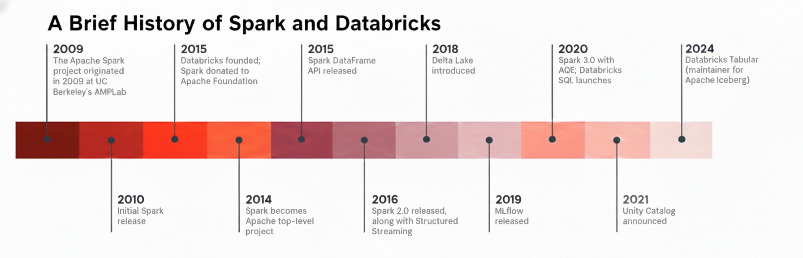

# [Databricks Inside] Databricks의 여정 (오픈 소스에서 데이터 지능형 플랫폼까지)

현대 데이터 엔지니어링과 AI 생태계에서 Databricks를 빼놓고 이야기하기는 어렵습니다. 오늘날 수만 개의 기업이 사용하는 이 플랫폼은 단순히 하나의 소프트웨어가 아니라, 데이터 처리의 패러다임을 바꾼 거대한 흐름의 중심에 서 있습니다.

이번 글에서는 Databricks의 뿌리인 Apache Spark의 탄생부터, 2024년 현재 데이터 레이크하우스(Lakehouse)의 선구자가 되기까지의 15년 역사를 간략하게 정리하였습니다.

## 📅 Databricks & Apache Spark 주요 연혁
먼저 Databricks와 Spark가 걸어온 길을 도식화하면 다음과 같습니다.

## 1. 2009년 - 2010년
### 🎂 혁신의 씨앗, UC Berkeley AMPLab과 Spark의 탄생
모든 위대한 여정은 작은 실험실에서 시작됩니다.

**2009년 프로젝트 시작:** Apache Spark 프로젝트는 2009년 UC 버클리의 AMPLab에서 처음 시작되었습니다.

배경: 당시 빅데이터 처리의 표준이었던 Hadoop MapReduce의 느린 속도와 반복 연산의 한계를 극복하기 위해 'In-Memory' 처리 방식이 고안되었습니다.

**2010년 초기 릴리즈:** 2010년에 Spark의 초기 버전이 대중에게 공개되며 혁신의 서막을 알렸습니다. 이로 '인메모리(In-Memory) 컴퓨팅'의 시대가 시작되었습니다.

## 2. 2013년 - 2014년
### 👊 Databricks의 설립과 Apache 재단 기여
Spark의 잠재력을 확인한 창립 멤버들은 이 기술을 전 세계적인 에코시스템으로 성장시키기 위한 결단을 내립니다.

**2013년 Databricks 설립:** Spark의 창시자들이 모여 Databricks를 설립했으며, 동시에 Spark 프로젝트를 Apache 재단에 기부했습니다.

**2014년 최상위 프로젝트 등극:** Spark는 그 기술력을 인정받아 2014년에 Apache의 최상위 프로젝트(Top-level project)가 되었습니다. 이후 Databricks는 지속적으로 개발을 주도해오고 있습니다.

## 3. 2015년 - 2016년: 
### ↗️ 사용자 중심의 진화 (DataFrame & Spark 2.0)
Spark는 초기 엔지니어 중심의 도구에서 더 넓은 분석가 층을 수용하기 시작했습니다.

**2015년 DataFrame API:** 데이터 분석가들이 SQL과 유사한 방식으로 대규모 데이터를 쉽게 다룰 수 있도록 Spark DataFrame API가 출시되었습니다. 복잡한 코딩 없이도 구조화된 데이터를 쉽게 다룰 수 있는 DataFrame API가 도입되어 분석가들의 진입 장벽을 대폭 낮췄습니다.

**2016년 Spark 2.0:** 성능이 대폭 개선된 Spark 2.0이 릴리즈되었으며, 실시간 데이터 처리를 위한 Structured Streaming이 함께 도입되었습니다.

## 4. 2018년 - 2019년: 
### 🤖 Delta Lake와 MLflow의 등장
Databricks는 단순한 연산 엔진을 넘어 데이터의 신뢰성과 머신러닝 관리로 영역을 확장했습니다.

**2018년 Delta Lake 도입:** 데이터 레이크 위에서 ACID 트랜잭션을 지원하여 데이터 신뢰성을 보장하는 Delta Lake가 소개되었습니다. 데이터 레이크의 한계였던 데이터 품질과 트랜잭션 문제를 해결하기 위해 Delta Lake를 발표하며 '레이크하우스'의 초석을 다졌습니다.

**2019년 MLflow 출시:** 머신러닝 모델의 복잡한 라이프사이클을 관리하기 위한 오픈 소스 플랫폼 MLflow가 공개되었습니다.

## 5. 2020년 - 2021년: 
### 📖 Lakehouse Paradigm과 Unity Catalog
이 시기 Databricks는 데이터 웨어하우스(DW)와 데이터 레이크(DL)를 결합한 'Lakehouse' 비전을 구체화했습니다.

**2020년 Spark 3.0 & SQL:** AQE(Adaptive Query Execution, 적응형 쿼리 실행)으로 성능을 한 단계 진화시킨 Spark 3.0이 출시되었고, 비즈니스 분석을 위한 (+ BI 도구와의 연동성을 극대화한) Databricks SQL이 런칭되었습니다.

**2021년 Unity Catalog:** 데이터와 AI 자산에 대한 통합 거버넌스를 제공하는 Unity Catalog가 발표되었습니다.

## 6. 2024년: 
### 🧊 Tabular 인수와 Iceberg 생태계 통합
가장 최근의 행보는 데이터 표준의 통합을 향해 있습니다.

**2024년 Tabular 인수:** Apache Iceberg의 주요 관리 주체인 Tabular를 인수하며, Delta Lake와 Iceberg라는 두 거대 포맷 사이의 상호 운용성을 확보하고 오픈 데이터 표준을 주도하고 있습니다.

## 🚀 정리하며: 왜 Databricks인가?
Databricks의 역사는 "복잡한 것을 단순하게, 느린 것을 빠르게, 닫힌 것을 열리게" 만들어온 과정입니다. Spark라는 강력한 뿌리에서 시작해 이제는 전사적 데이터와 AI를 아우르는 거대한 레이크하우스 생태계를 완성했습니다.

단순히 기술적 우위에 머무는 것이 아니라, 지속적으로 오픈 소스 커뮤니티와 호흡하며 표준을 만들어가는 Databricks의 행보는 앞으로도 데이터 엔지니어들에게 가장 중요한 이정표가 될 것으로 생각합니다.

✍️ 2026년 1월 15일 씀.