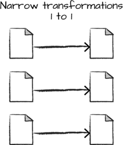
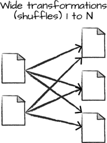

# [Databricks Inside] RDD(Resilient Distributed Dataset)

Apache Spark를 배우다 보면 자연스럽게 등장하는 개념이 있습니다. 바로 **RDD(Resilient Distributed Dataset)** 입니다.

대부분의 사람들이 "요즘은 Spark SQL 혹은 DataFrame을 사용하는데, RDD를 굳이 배울 필요가 있을까?"라는 의문을 갖습니다.

정답은 **Yes**입니다.

이유는 다음과 같습니다:

* RDD는 Spark의 가장 핵심이자 근본적인 데이터 모델
* DataFrame과 Dataset도 내부적으로는 결국 RDD로 변환되어 실행
* 성능 이슈를 이해하거나 튜닝하려면 RDD의 동작 메커니즘을 반드시 이해해야 함
* 일부 고급 작업(커스텀 분산 처리, 저수준 연산)은 RDD가 아니면 구현이 어려움

따라서 Spark 초보자에게도 RDD 개념을 정확하게 잡는 것은 매우 중요합니다.

이 글에서는 코드 예제 중심으로 차근차근 살펴보겠습니다.

이번 글에서 다뤄지는 주제는 다음과 같습니다.
1. [RDD 소개](#1-rdd란)

    1.1 [RDD란?](#11-정의)

    1.2 [왜 RDD가 중요한가?](#12-왜-rdd가-중요한가)

    1.3 [RDD의 특징](#13-rdd의-특징)

2. [RDD의 동작 방식](#2-rdd의-동작-방식)

    2.1 [Lazy Evaluation(지연 실행)](#21-lazy-evaluation지연-실행)

    2.2 [Lineage(계보, 복구 메커니즘)](#22-lineage계보-rdd의-복구-원리)

    2.3 [Partition(파티션 구조)](#23-partition파티션)

    2.4 [Shuffle의 동작 원리](#24-shuffle의-동작)

3. [RDD API](#3-rdd-api)

    3.1 [Transformation](#31-transformation)

    * [Shuffle이 필요 없는 Transformation](#311-shuffle이-필요-없는-transformation)

    * [Shuffle이 필요한 Transformation](#312-shuffle이-필요한-transformation)

    3.2 [Action](#32-action)

    3.3 [RDD 전체 처리 흐름 예제](#33-rdd-예제-전체-흐름)

4. [Best Practices](#4-best-practices)

***

## 1. RDD란?
### 1.1 정의
RDD(Resilient Distributed Dataset)는 대량의 데이터를 컴퍼넌트로 가지는 분산 collection이라고 할 수 있습니다.

RDD는 여러 머신으로 구성된 클러스터에서 분산처리를 하기 위해서 설계된 것으로, 내부는 파티션(partition)이라는 단위로 나누어 집니다. 

Spark에서는 이러한 파티션 단위로 분산처리를 수행합니다. 

즉, RDD를 파티션 단위로 여러 개의 머신에서 처리함으로써 대량의 데이터에 대한 연산을 수행할 수 있습니다.

RDD는 다음의 키워드들로 기억하면 됩니다:

* Resilient: 복구 가능
* Distributed: 클러스터에 분산 저장
* Dataset: 데이터 컬렉션

즉, **클러스터 여러 노드에 분산되어 저장되고, 장애가 발생하여도 복구할 수 있는, 변경 불가능한(immutable) 데이터 집합**을 의미합니다.

### 1.2 왜 RDD가 중요한가?

* Spark의 모든 고급 API(DataFrame, Dataset, Spark SQL)는 최종적으로 RDD로 변환되어 실행됨.
* RDD의 동작 원리를 이해하면 Spark의 성능 구조를 제대로 이해할 수 있음.
* 특히 shuffle, 파티셔닝, 스테이지 분리, lazy evaluation 등(각각의 내용은 별도의 강좌로 정리할 예정입니다)을 완벽히 이해할 수 있음.

### 1.3 RDD의 특징

|특징 | 설명|
|---|---|
|Immutable | 원본 데이터는 절대 수정되지 않고, 항상 새로운 RDD가 생성됨|
|Lazy Evaluation|action 호출 전까지 transformation은 실제 실행되지 않음|
|Partitioned|데이터는 여러 파티션으로 나뉘어 각각의 Executor에서 처리됨|
|Fault-tolerant|lineage를 통해 장애 시 자동 복구|
|Distributed|노드 여러 개에 자동 분배되어 병렬 처리|

## 2. RDD의 동작 방식

RDD는 Spark의 기초 설계 철학을 그대로 담고 있습니다. 전체 동작 과정은 다음과 같은 흐름으로 이해할 수 있습니다.

### 2.1 Lazy Evaluation(지연 실행)

Spark의 transformation은 즉시 실행되지 않고, **계산 그래프(DAG)** 형태로 쌓일 뿐입니다.

아래 코드를 보겠습니다:

```python

rdd = sc.textFile("logs.txt")
words = rdd.flatMap(lambda x: x.split(" "))
filtered = words.filter(lambda w: len(w) > 5)
count = filtered.count()

```

여기서 4번째 줄의 count()가 호출되기 전까지는 **실제 연산이 전혀 일어나지 않습니다**.

마지막 count()가 호출되는 순간:

* 필요한 transformation을 모두 연결
* 스테이지를 나누고
* shuffle 여부를 판단하고
* 최종적으로 클러스터에 작업을 배포합니다

이것이 Spark의 핵심 성능 원리입니다.

### 2.2 Lineage(계보, RDD의 복구 원리)
RDD는 데이터를 복제해 두지 않고도 장애 시 복구가 가능합니다.

그 비밀이 바로 **lineage**입니다.

예:
> textFile → flatMap → filter → map → reduce

Spark는 "어떤 transformation을 어떤 순서로 적용했는지" 기록합니다.

만약 특정 파티션이 장애로 날아가도 Spark는 lineage를 통해 **그 파티션만 다시 계산**하면 됩니다.

### 2.3 Partition(파티션)
데이터는 여러 파티션으로 나뉘어 처리됩니다.

* 각 파티션은 하나의 Executor Core에서 처리됨
* 파티션 수가 적으면 병렬성이 낮고
* 너무 많으면 스케줄링 비용이 증가

**예:**
```python
rdd = sc.textFile("logs.txt", minPartitions=10)
```

### 2.4 Shuffle의 동작
Shuffle은 Spark에서 가장 비용이 큰 작업입니다.

Shuffle이 발생하면 다음과 같은 일들이 일어납니다:

* 데이터가 네트워크를 통해 다른 노드로 이동
* 디스크에 임시 파일로 기록
* 정렬(sort), 집계(aggregation) 등이 진행됨

즉, **성능 저하의 가장 큰 원인**이므로 ***shuffle을 최소화하는 것이 매우 중요***합니다.

## 3. RDD API 
RDD API는 크게 두 종류로 구분됩니다:

* Transformation: 새로운 RDD 생성, lazy
* Action: 즉시 실행, 결과 반환

### 3.1 Transformation
Transformation은 RDD를 입력받고 **새로운 RDD를 반환하는 연산**입니다.

이들은 언제 실행될까요?

**→ action이 호출될 때!**

Transformation은 shuffle이 필요한 경우, 필요 없는 경우로 나눌 수 있습니다.

#### 3.1.1 Shuffle이 필요 없는 Transformation

Shuffle이 필요 없는 transformation(Narrow Dependency라고도 합니다)은 성능 비용이 매우 낮습니다.



즉, **기존 파티션 내부에서만 처리**됩니다.

아래 transformation들은 shuffle이 발생하지 않습니다:

* map()
* flatMap()
* filter()
* mapPartitions()
* sample()
* union()
* coalesce() (단, shuffle=False일 때)
* glom()

**예: map()**

```python
rdd2 = rdd.map(lambda x: x * 2)
```
→ 각 요소를 2배로 만드는 작업은 파티션 내부에서만 처리 가능합니다.

→ shuffle 없음.

#### 3.1.2 Shuffle이 필요한 Transformation
Shuffle이 필요한 transformation(Wide Dependency라고도 합니다)은 반드시 **데이터 재배치**가 일어납니다.



다음 연산들은 모두 shuffle을 발생시킵니다:

* reduceByKey()
* groupByKey()
* join(), leftOuterJoin()
* distinct()
* repartition()
* coalesce(shuffle=True)
* sortBy()
* aggregateByKey()
* cogroup()

**예: reduceByKey()**
```python

pairs = rdd.map(lambda x: (x.split(",")[0], 1))
counts = pairs.reduceByKey(lambda a, b: a + b)

```
Key가 동일한 요소를 서로 모으려면, 
각 파티션에 흩어져 있는 **동일 Key를 한 곳으로 모아야 합니다**.

즉, shuffle 발생.


groupByKey() vs reduceByKey()는 둘 다 shuffle을 발생시키지만,

* groupByKey() → 더 큰 shuffle 발생
* reduceByKey() → map-side combine 가능 → 더 효율적

실무에서는 reduceByKey()를 우선으로 사용합니다.

### 3.2 Action
Action은 transformation들을 실제로 실행하여 결과를 리턴하거나 외부 저장소에 저장합니다.

대표 Action들은 다음과 같습니다:

|함수|설명|
|---|---|
|collect()|모든 데이터를 드라이버로 가져옴(주의: 메모리 폭발 위험)|
|count()|전체 요소 개수|
|first()|첫 번째 요소|
|take(n)|n개만 가져오기|
|reduce(func)|전체 dataset을 하나의 값으로 축약|
|saveAsTextFile(path)|외부 저장|
|foreach(func)|각 요소에 함수 적용|

### 3.3 RDD 예제 전체 흐름

Spark 어플리케이션이 동작하는 전체 흐름을 간단하게 정리하면 다음과 같습니다.

**시작 → Transformation → Action**

```python

# 1. 읽기
rdd = sc.textFile("data.txt")

# 2. transformation
words = rdd.flatMap(lambda x: x.split(" "))
pairs = words.map(lambda w: (w, 1))
counts = pairs.reduceByKey(lambda a, b: a + b)

# 3. action
for w, c in counts.take(10):
    print(w, c)

```

* 여기서 shuffle은 reduceByKey()에서 발생되며, 
* 나머지는 모두 파티션 내부에서 실행됩니다.

## 4. Best practices
* **collect() 남용 금지 :** 드라이버 메모리 초과로 클러스터 다운.
* **shuffle은 성능의 적 :** 가급적 reduceByKey(), map-side combine을 사용.
* **groupByKey()는 위험 :** 가능하면 reduceByKey()나 aggregateByKey()로 대체.
* **파티션 수 조절은 성능 핵심 :** 작업 크기 대비 적절한 파티션 설계가 중요.
* **RDD는 사실 저수준 API :** 가능하다면 DataFrame을 우선 사용하고, RDD는 필요한 경우에만 사용.
*  **action은 호출 전까지 실행되지 않음 :** debug 할 때 출력이 안됨.
* **lineage가 길어지면 체크포인트 필요 :** 장기 파이프라인 작업에서 중요.

✍️ 2026년 1월 16일 씀.