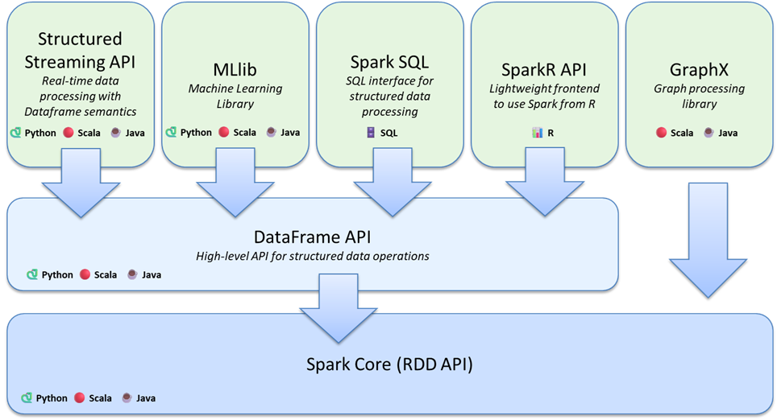

# [Databricks Inside] Apache Spark 구성 요소 아키텍처

Apache Spark는 여러 컴퍼넌트들로 구성되어 있습니다. 병렬분산처리 엔진에 해당하는 Spark Core를 중심으로 용도에 따른 라이브러리들이 제공됩니다. 

Spark가 단순한 연산 엔진을 넘어 거대한 생태계를 형성할 수 있었던 비결은 정교하게 설계된 레이어 구조에 있습니다.

## 기초 계층: Spark Core (RDD API)

### 요약
먼저 그림의 가장 아래에 있는 Spark Core는 **모든 연산의 심장부**입니다. Python과 Scala/Java를 지원하며, 분산 환경에서 데이터를 처리하는 근간인 **RDD(Resilient Distributed Dataset) API**를 제공합니다. 메모리 관리, 장애 복구, 작업 스케줄링 등 가장 핵심적인 기능을 담당합니다.

### 좀 더 들어가보면
Spark Core는 Resilient Distributed Dataset(RDD) 추상화, DAG 스케줄러, 태스크 실행기, 메모리 관리, 체크포인팅, I/O, 클러스터 매니저와의 연계를 담당합니다. RDD는 불변/분산 컬렉션으로, map, filter, reduceByKey 같은 **변환(transformations)** 과 count, collect 같은 **액션(actions)** 으로 조합됩니다. RDD는 타입 안정성과 저수준 제어가 장점이지만, 스키마·최적화 측면에서 수동 관리가 필요합니다.

## 중간 추상화 계층: DataFrame API
### 요약

중간에 있는 DataFrame API 계층은 Spark Core 위에서 동작하며, **구조화된 데이터 작업을 위한 고수준 API**를 제공합니다. 

관계형 데이터베이스의 테이블처럼 데이터를 다룰 수 있게 해주며, 엔진 내부에서 쿼리 최적화(Catalyst Optimizer)를 통해 성능을 극대화합니다. 이 계층 덕분에 개발자는 저수준의 복잡한 로직 대신 비즈니스 로직에 집중할 수 있습니다.

### 좀 더 들어가보면
**DataFrame은 열(column) 기반의 분산 테이블**로, 스키마(컬럼명·타입)를 보유합니다. 내부적으로는 Catalyst Optimizer가 논리/물리 계획을 생성하고, Tungsten 엔진이 메모리/코드 생성 수준의 최적화를 수행하여 빠르게 실행합니다. 다이어그램에서 DataFrame API가 중앙에 크게 배치된 이유가 바로 여기에 있습니다. 상위 대부분의 라이브러리가 DataFrame 위에서 동작합니다.

## 상위 라이브러리 계층 (Unified Stack)
사용자의 목적에 따라 최적화된 도구들을 제공합니다.

* Structured Streaming API: 
    * DataFrame 세만틱을 활용하여 실시간 데이터 처리를 지원합니다.
    * DataFrame API를 스트리밍에도 그대로 사용한다는 장점을 가집니다. 입력은 Kafka/Files/Socket 등, 출력은 Delta/Kafka/Memory/Table 등으로 구성하고, 마이크로 배치 또는 연속 처리(continuous) 모드로 실행합니다. 이벤트 타임/워터마크/집계 상태 관리를 지원하여 지연 데이터 처리 및 정확성 보장을 용이하게 합니다.

* MLlib: 
    * 대규모 분산 환경에서 동작하는 강력한 머신러닝 알고리즘 라이브러리입니다.
    * 피처 추출/변환, 파이프라인, 분류/회귀/클러스터링, 추천(ALS) 등 대용량 데이터에 특화된 분산 ML을 제공합니다. 
    * DataFrame과 자연스럽게 연동되어 Pipeline/Transformer/Estimator 개념으로 워크플로를 구성합니다.

* Spark SQL: 
    * SQL 인터페이스를 통해 구조화된 데이터를 직접 조회하고 분석할 수 있게 합니다. 
    * Spark SQL은 DataFrame과 동일한 실행 엔진을 사용하지만, ANSI SQL에 가까운 문법으로 질의를 작성할 수 있게 해 줍니다. 테이블/뷰 카탈로그, UDF/UDTF, 서브쿼리, 윈도 함수 등 현대 SQL 기능을 폭넓게 제공합니다.
    * 언제 유용한가?
        * 데이터 애널리스트/BI 팀과 협업(익숙한 SQL 언어)
        * DataFrame과 혼용하여 파이프라인 구성(예: ETL은 SQL, ML 전처리는 DataFrame)

* SparkR API: 
    * R 언어 환경에서도 Spark의 강력한 성능을 활용할 수 있는 프론트엔드를 제공합니다.
    * R 환경에서 DataFrame 연산과 MLlib 일부 기능을 사용할 수 있게 해 줍니다. 데이터 과학자가 R 문법을 유지하면서 대규모 분산 처리를 활용할 수 있다는 점이 장점입니다. 

* GraphX: 
    * 복잡한 관계를 다루는 그래프 처리 및 분석 라이브러리입니다.
    * GraphX는 그래프(정점/간선) 연산을 위한 라이브러리로, PageRank, Connected Components 같은 알고리즘을 제공합니다.
    * 언제 유용한가?
        * 소셜 네트워크 분석, 추천에서의 유사도 그래프, 지식 그래프의 연결성 탐색
        * 분산 환경에서 대규모 그래프 계산이 필요한 경우

## 지원 언어 
*  : PySpark, 생산성이 높아 데이터 엔지니어링/데이터 과학에서 가장 널리 쓰입니다.

*  : 엔터프라이즈 스택 통합에 유리합니다.

*  : Spark의 네이티브 언어로, 최신 기능이 가장 빠르게 출시되고 성능과 타입 안정성이 강점으로 제공됩니다.

*  : 데이터 분석가에 친화적으로, BI/ETL 파이프라인에서 표준으로 사용됩니다.

*  : R 생태계와의 연계가 가능합니다.

## 자료

* 아키텍처 ppt slide : [spark_components](/lectures/databricks-inside/slide-dekcs/Spark_components.pptx)

✍️ 2026년 1월 19일 씀.